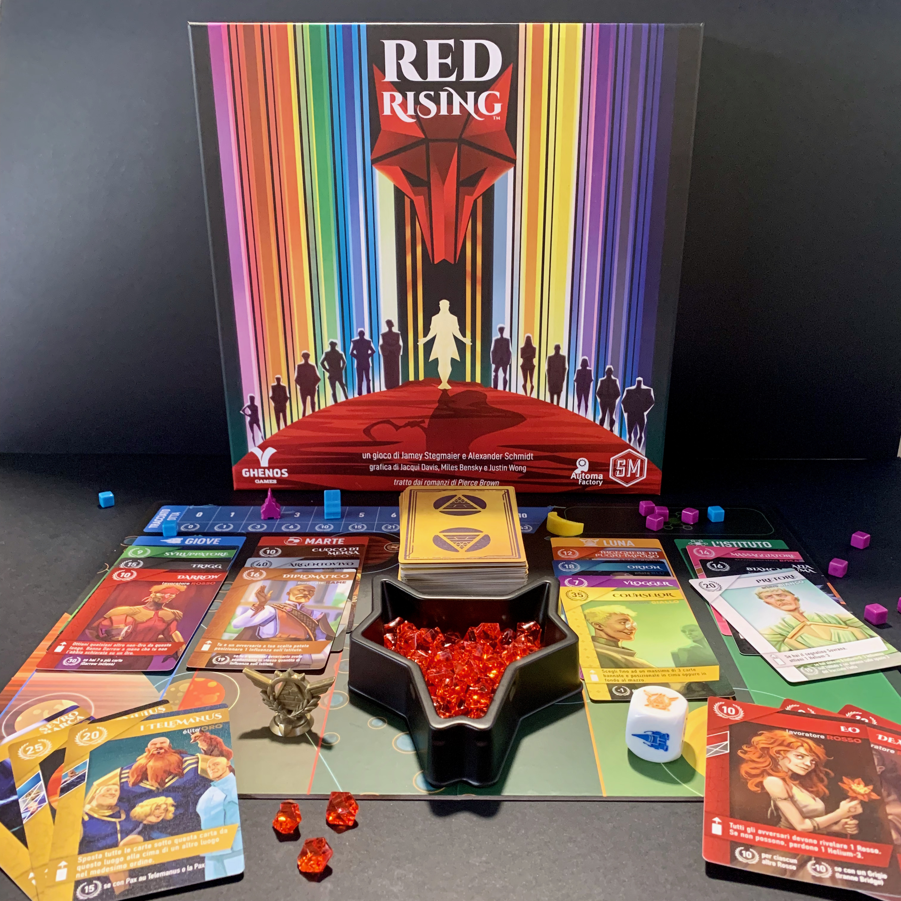
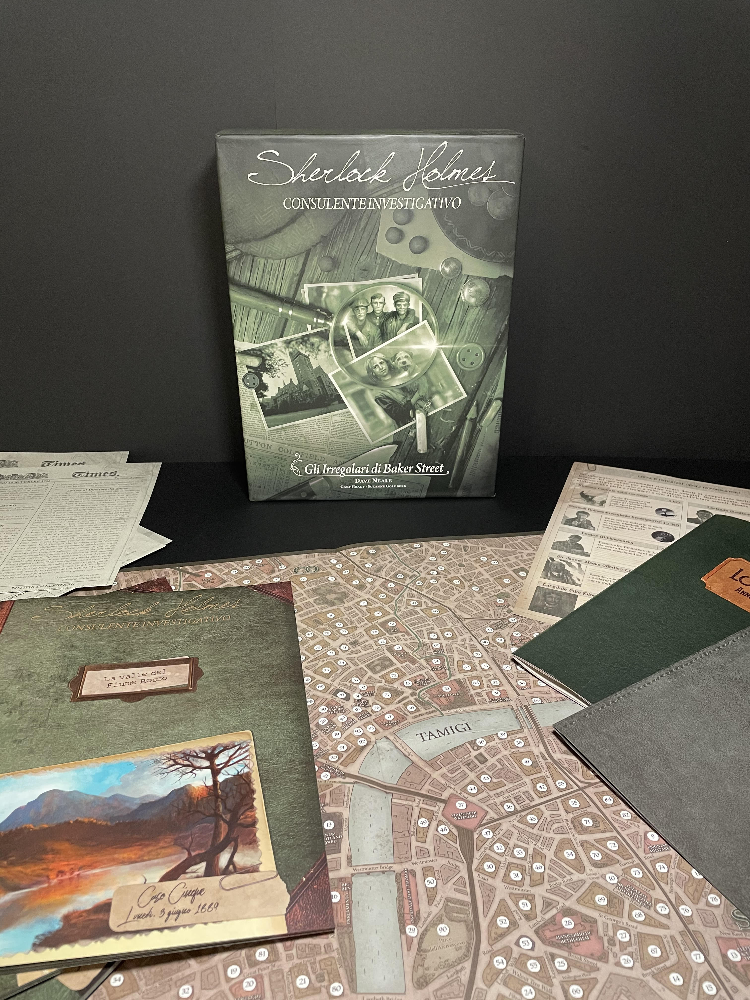
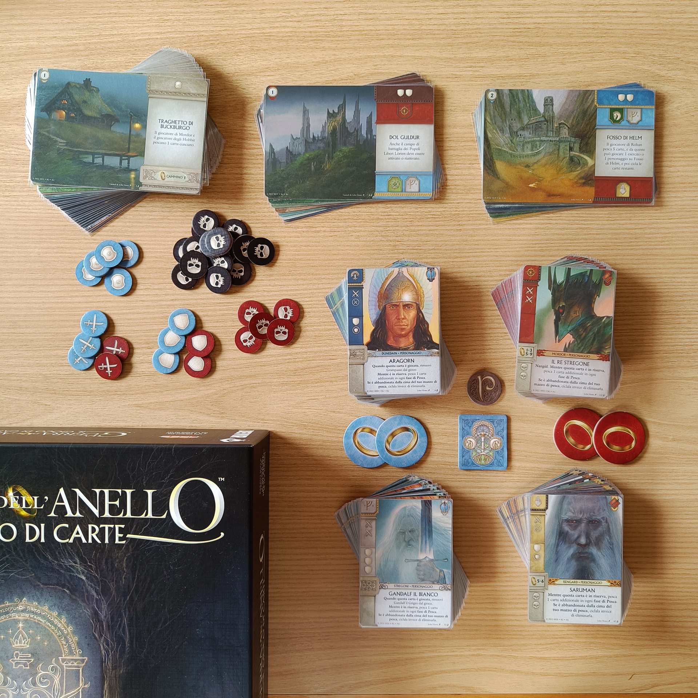

<AdvisorIntro>
  Quando un classico letterario è davvero tale, ha il potere di generare mille riletture culturali del proprio nucleo
  identitario. Se davvero, come diceva Italo Calvino, un classico è un libro che non ha mai finito di dire quel che ha
  da dire, forse possiamo immaginare che legittimamente il classico possa esprimere quello che ha ancora da dire
  attraverso altri linguaggi e altre forme. Nulla di strano, perciò, che i classici tornino in forma televisiva,
  fumettistica, artistica in generale e, nell’epoca dell’intrattenimento di massa, anche in forma ludica.
   
  Abbiamo selezionato quattro giochi da tavolo che ripropongono, secondo noi con ottimi risultati, rivisitazioni
  divertenti e immersive di classici che abbiamo letto (si spera) e amato! Tuffatevi in un Marte distopico del futuro,
  nella Londra di età vittoriana, nella Terra di Mezzo e nelle pieghe dell’orrida realtà di Arkham, Massachusetts!
</AdvisorIntro>

<AdvisorBit slug="red-rising" writer="Tia">
  Un gioco costruito attorno a un romanzo? Ma certamente: Red rising di Pierce Brown! Red rising è un mondo distopico,
  un futuro Marte, dove{" "}
  <strong>
    le persone appartengono a un colore a seconda della loro professione, della loro ricchezza, della loro influenza
  </strong>
  . In questo romanzo si vivranno le vicende del <strong>
    Rosso minatore Darrow mentre si infiltra nei ranghi dell'élite Oro
  </strong>. Il gioco Red Rising, edito da Stonemaier (<Link to="/reviews/scythe">Scythe</Link>, vi dice nulla?) parla di
  alleanze, di contrasti e di collaborazioni fortuite tra tutti i personaggi del romanzo. Partiremo con 5 carte in mano e,
  turno dopo turno,
  <strong> scarteremo una carta per pescarne un'altra</strong>. La carta scartata, a seconda del "luogo" dove verrà
  calata, ci farà salire su una track, fortificando alcune delle carte e avvicinandoci sempre più al fine partita. Lo
  scopo è quello che tutte le carte che abbiamo in mano vadano in combo e facciano un sacco di punti (quindi occhio a
  quello che scartate)!
   
  <strong> Red Rising è un Fantasy Realms</strong> con un'ambientazione indovinata e una cura del dettaglio da lasciare
  senza parole.
</AdvisorBit>

<AdvisorBit slug="sherlock-holmes-consulente-investigativo" writer="Eris.in.Boardgameland">
  Uno dei titoli di maggior pregio quando si pensa all’intreccio tra letteratura e gioco da tavolo è sicuramente{" "}
  <strong>Sherlock Holmes: Consulente Investigativo</strong>. 
  <strong>10 casi unici</strong> che vi catapulteranno in una Londra vittoriana oscura e dominata dal crimine, nella quale,
  equipaggiati con una <strong>mappa dettagliata</strong>, qualche copia del giornale <strong>The Times</strong>, una <strong>
    lista di informatori
  </strong> e l’<strong>Annuario</strong> della città, che, come delle antiche pagine gialle, vi guiderà tra le vie della
  capitale britannica, dovrete seguire le orme del più celebre investigatore della letteratura, tentando di <strong>
    raggiungere la verità
  </strong>. Impresa non facile, che metterà alla prova le vostre <strong>abilità deduttive</strong>, ma una volta giunti
  al termine dell’avventura la soddisfazione sarà impagabile. Una nota di merito a due set in particolare: il terzo, nel
  quale ben quattro casi, gli unici di tutta la collana connessi tra loro, ripercorrono accuratamente gli omicidi commessi
  da <em>Jack lo Squartatore</em>, e senz’altro il quarto, ovvero l’ultimo pubblicato, <em>
    Gli Irregolari di Baker Street
  </em>, che porta a compimento un <strong>sistema di gioco ampiamente collaudato e amato da molti</strong>. È impossibile
  non innamorarsi di questo <strong>classico sempreverde</strong>: e, come dice il maestro, «Una volta eliminato l’impossibile,
  ciò che resta, per quanto improbabile, dev’essere la verità». <strong>Elementare no</strong>? Andate a provarlo!
   
</AdvisorBit>

<AdvisorBit slug="arkham-horror-lcg" writer="Dadi-Daddy">
  Sperimentate «la cosa più misericordiosa al mondo»: sperimentate «l’incapacità della mente umana di mettere in
  relazione i suoi molti contenuti» (H.P. Lovecraft, <em>Il Richiamo di Cthulhu</em>).
   
  <em>Arkham Horror: Il Gioco di Carte</em> non è solo un gioco da tavolo. È sì <strong>uno dei migliori</strong>, se
  non il migliore, <strong>LCG in circolazione</strong>; è sì un prodotto ludico dalla{" "}
  <strong>qualità estetica raffinata</strong>, come solo la Fantasy Flight Games sa farne; ma è anche il vertice di un{" "}
  <strong>sorprendente omaggio</strong> ai capolavori del <strong>tormentato e controverso H.P. Lovecraft</strong>. Un
  titolo che <strong>contamina</strong> con equilibrio e precisa conoscenza del suo referente letterario un flusso di
  gioco <strong>accattivante</strong>, <strong>dinamico </strong>ed estremamente <strong>sfidante </strong> con gli
  elementi di <strong>espressionismo narrativo</strong> più tipici del padre di un genere "weird", a metà tra l’
  <strong>horror </strong>e il
  <strong> dark fantasy</strong>. Difficilmente troverete in circolazione un’esperienza di gioco come questa, che vi consentirà
  di costruire profili di <strong>investigatori sempre diversi</strong> e vi farà confrontare con i misteriosi incubi antichi
  e gli innominabili orrori cosmici del mondo lovecraftiano.
   
  La fortunata serie continua a stupirci con <strong>nuove campagne</strong> (tre nell’ultimo anno e mezzo, se si conta anche
  la pubblicazione – in Italia prevista per gennaio 2024 presso Asmodee – de “La festa di Hemlock Vale”). Perciò radunate
  la vostra squadra, fatevi <em>coraggio</em> (<em>liquido</em>) e lanciatevi nello <strong>
    straniante e travolgente
  </strong> mondo di <em>Arkham Horror: Il Gioco di Carte</em>! 
</AdvisorBit>

<AdvisorBit slug="la-guerra-dell-anello-il-gioco-di-carte" writer="LoveIsOnTheBoard">
  Nel 1954 un professore di Oxford pubblicò un libro, il primo di una trilogia destinata a diventare una pietra miliare
  dei nostri tempi, nella quale si racconta la storia di un intero mondo che avrebbe popolato i sogni e le fantasie di
  intere generazioni: Il Signore degli Anelli.
   
  “La Guerra dell’Anello - Il Gioco di Carte” è il miglior gioco (insieme alla versione “dudes on a map”, pubblicata per
  la prima volta nel 2004) per rivivere questa epica storia scritta da J.R.R. Tolkien: una sfida vibrante, da affrontare
  in due squadre, con delle regole semplici ma un gameplay profondo e strategico, e capace di trasportarti all’interno
  dell’universo del Signore degli Anelli…e il tutto con delle semplici carte! Sicuramente uno dei giochi più belli
  pubblicati negli ultimi anni, da provare almeno una volta nella vita.
</AdvisorBit>

