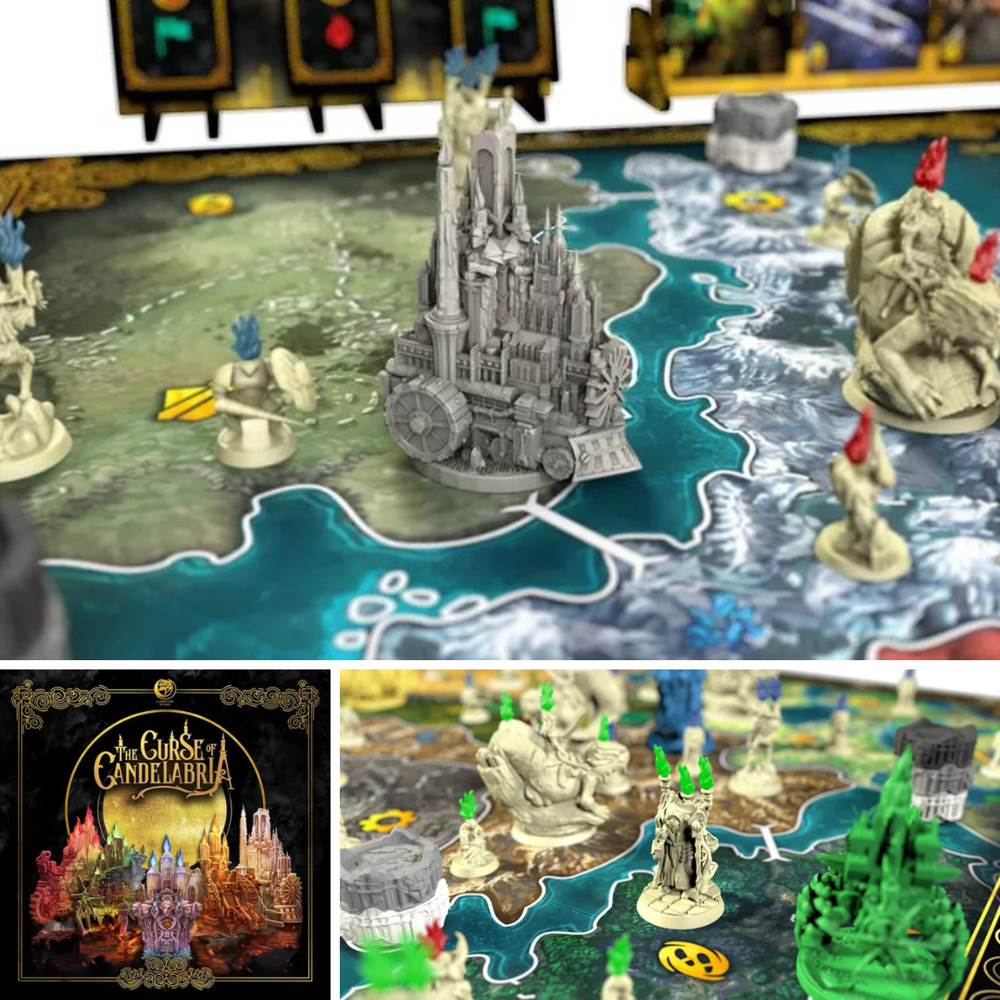

<FundingIntro>
  In un mondo in cui ci sono più kickstarter che essere umani, in cui i giochi
  possono o essere castronate assurde o figate assolute i quattro pezzi di oggi
  sono un gioco sulle candele che sembra ispirato a Lumiere, un gioco per
  studiosi e sicuramente non daltonici, un gioco che si rischierà di bere e un
  gioco per cui i designer si sono ispirati a tutti i vostri giochi preferiti
  per realizzarlo!
</FundingIntro>

<FundingBit
  title="The course of Candelabria"
  player_count={3}
  player_count_official="3-5"
  weight={3}
  playing_time="90min"
  playing_time_official="60-120min"
  hype={7}
  deadline="15/03/2023"
  delivery="04/2024"
  price="89€"
  otherPrice="28€ + VAT"
  designer={["Davide Carcelli", "Gabriel Porro"]}
  publisher={["Lunar Oak Studio"]}
  mechanism={[
    "Movimento ad area",
    "Maggioranze",
    "Risoluzione conflitti con carte",
  ]}
>
  In curse of Candelabria i giocatori impersoneranno i reggenti di casate con
  candela personaggi in un gioco di controllo ad Area con alta interazione tra
  giocatori. Niente sembra essere dettato dal caso e solo le abilità dei
  giocatori permetteranno di determinare un vincitore. Durante ogn turno
  dovranno manipolare le proprie candele a disposizione per aumentare le proprie
  abilità in battaglia grazie anche a carte tattica e carte abilità speciali.
  Tutto questo condiro poi da bellissime miniature e altre fantasmagoriche
  meccaniche. Curse of Candelabria è un gioco che potrebbe far gola a tutti gli
  amanti del controllo territori e a tutti quei giocatori che sentono il bisogno
  di poter controllare ogni singolo aspetto del combattimento! In fondo niente è
  lasciato al caso giusto? Neanche la paralisi d’analisi vero?
</FundingBit>

<RandomLink
  title="The course of Candelabria"
  link="https://www.kickstarter.com/projects/lunaroakstudio/the-curse-of-candelabria-0?ref=section-homepage-view-more-recommendations-p1/"
  small
/>
