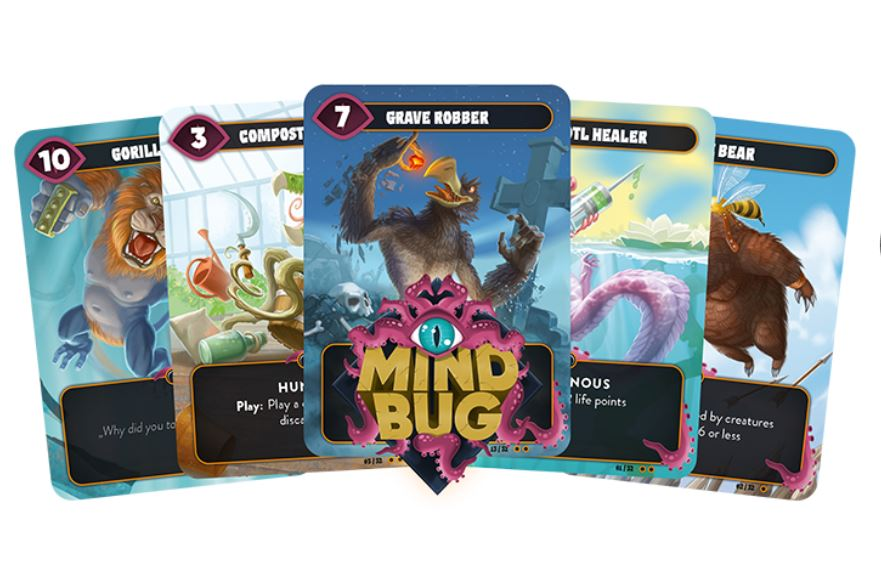

<Setting>
  Evoca mostruose creature ibride e affronta i tuoi avversari, ma attenzione ai
  Mindbug!!!
</Setting>

<Rules>
  In Mindbug ogni giocatore avrà un mazzo di 10 carte casuali prese da un mazzo
  comune. Con queste carte si dovrà portare a 0 i punti vita dell’avversario (3
  ad inizio partita). Si avranno <strong>sempre 5 carte</strong> in mano e ogni
  carta rappresenta una creatura. Le creature avranno una forza, con cui
  potranno attaccare l'avversario, e/o abilità che si potranno attivare in
  determinate occasioni, come ad esempio quando verranno giocate,distrutte o
  quando attaccheranno. Nel proprio turno un giocatore potrà o giocare una carta
  dalla propria mano, senza nessun costo, o attaccare con una creatura già
  presente sul campo di battaglia. A questo punto il giocatore in difesa potrà o
  subire un danno o bloccare con una creatura, ovviamente la creatura con meno
  forza perirà nello scontro. L'aspetto più interessante di questo gioco è il{" "}
  <strong>Mindbug</strong>. Infatti, quando un giocatore gioca una carta dalla
  mano, l'avversario potrà rubare e <strong>prendere il controllo</strong> di
  quella carta usando un Mindbug, giocandola e attivando tutti gli eventuali
  effetti di quella carta, cambiando letteralmente le sorti della partita.
  Questa opportunità però è limitata <strong>solo a due</strong>, costringendo i
  giocatori a gestire al meglio le scarse risorse a loro disposizione.
</Rules>

<Feedback>
  Che dire, Mindbug è davvero ben fatto, piccolo, tascabile e pieno zeppo di
  strategia, in parole povere{" "}
  <strong>un Magic: the gathering liofilizzato</strong>. La semplicità delle
  regole, unita alle partite veloci e ricche di suspense, dove davvero una
  singola mossa, un Mindbug al momento sbagliato, vi farà perdere la partita,
  permettono di tenervi incollati alle sedie partita dopo partita. La
  rigiocabilità, inoltre, pur avendo così poche carte, 48 nella versione base, è
  comunque abbastanza elevata. Giocherete ogni volta con{" "}
  <strong>solo dieci carte</strong> per giocatore, quindi le sorprese e i colpi
  di scena sono sempre dietro l'angolo. Consiglio, per i giocatori più accaniti
  e competitivi, di giocare al meglio dei tre, scambiandosi il mazzo di carte
  dopo la prima partita. Perché sì, ogni tanto il mazzo di carte davvero forte
  può arrivare, ma la possibilità di vincere c'è sempre, grazie a questa trovata
  dei Mindbug. I materiali non gridano al miracolo, ma stiamo comunque parlando
  di un gioco di carte, anche se il design e le arts sono davvero belle da
  vedere.In conclusione, Mindbug è stato un gioco che mi ha davvero sorpreso, un
  cofanetto che racchiude davvero un piccolo mondo di strategie e divertimento,
  uno di quei giochi da tavolo da avere sempre in tasca o nello zaino per una
  partita. Una piccola chicca che, a mio avviso, non dovreste farvi scappare.
   
  Ringrazio{" "}
  <OutboundLink
    href="https://www.kickstarter.com/projects/nerdlab-games/mindbug-first-contact"
    target="_blank"
  >
    il team di Mindbug
  </OutboundLink>{" "}
  per avermi concesso una copia per questa recensione.
</Feedback>

<Instagram id="CXD40k8AKl7" />
