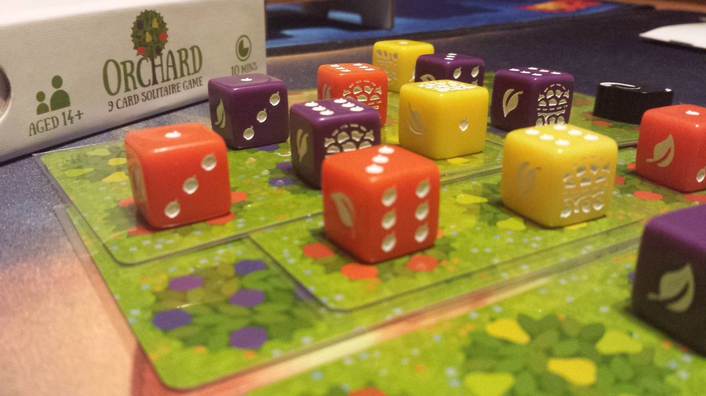

<Setting>
  Orchard è un gioco da 1 giocatore in cui bisognerà giostrare 9 carte composte
  da 6 simboli di 3 colori diversi in modo da ottenere il massimo punteggio
  possibile. Come si ottiene però questo punteggio? Ogni carta messa sovrapporrà
  uno o più simboli e se essi sono uguali la sovrapposizione sarà valida ed essa
  farà aumentare il punteggio del proprio Orchard (== frutteto ndt) grazie ad un
  contatore (5 per colore). Il problema? Ogni volta che si sovrapporranno
  simboli diversi si otterrà un segnalino frutta marcia che a fine partita varrà
  punti negativi. La partita finisce quando le 9 carte sono esaurite o quando il
  giocatore non può più disporre contatori punti positivi o negativi.
</Setting>

<Rules>RULES DI Orchard! Orchard! Orchard!</Rules>

<Spotify playlistId="5vymJZWeWphxmQmnRqqutE" />

<Feedback>
  Orchard è uno di quei magnifici giochi che non dovrebbero mancare nella
  collezione di un Solo-gamer. in quindici minuti si fa una partita e salvando
  la sequenza in cui viene formato il mazzo (ogni carta è numerata) Orchard non
  sarà un semplice beat-your-own-score fine a sè stesso, ma darà anche la
  possibilità al giocatore di poter migliorare la propria strategia fino ad
  arrivare al massimo punteggio ottenibile per ogni sequenza di 9 carte.
   É orchard però privo di difetti? Purtroppo no, infatti come la maggior parte
  dei mini giochi il divertimento va scemando sempre più andando a sostituirsi a
  quella sensazione di stare risolvendo un “semplice” esercizio di logica.
</Feedback>

<Youtube id={"iwzA_s9gTnQ"} title={"iwzA_s9gTnQ"} />
