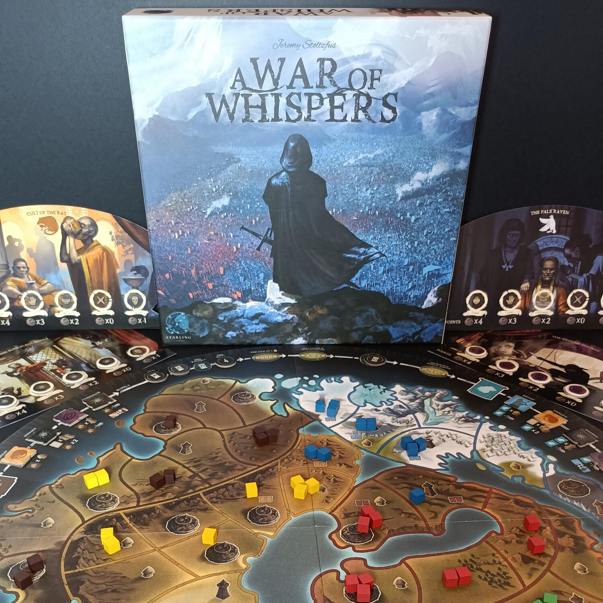

<Setting>
  Cinque regni sono scesi in guerra. Gloria, potere e sangue scorrono sui campi
  di battaglia. Lupi, Aquile, Elefanti, Leoni e Cavalli. Una guerra senza fine;
  scontri di uomini con un solo destino: la vittoria o la morte. Ma questa non è
  una di quelle guerre cantate dai bardi, con dame e cavalieri,{" "}
  <strong>questa è la guerra dei sussurri</strong>. Emissari, agenti e assassini
  saranno il tuo esercito. Prepara il veleno dei tuoi Ragni, ascolta il vociare
  con i tuoi Corvi, corri tra i vicoli come un Ratto o striscia da Serpente tra
  le gambe dei tuoi avversari. Dietro le quinte, nell'oscurità, una nuova guerra
  inizia il suo primo atto, avrai la stoffa per uscirne vincitore?
</Setting>

<Rules>
  In A war of Whispers non gestirai una fazione o gli eserciti sul campo di
  battaglia, bensì, <strong>tirerai i fili dietro le quinte</strong> portando
  alla vittoria i tuoi alleati e alla disfatta i tuoi nemici. Una volta
  preparata la mappa, posizionando i vessilli degli eserciti iniziali, ogni
  giocatore, in maniera casuale, dovrà posizionare i suoi segnalini lealtà sugli
  appositi spazi. Il gioco dura esattamente <strong>4 Round</strong>. Nella
  prima fase i giocatori posizioneranno a turno due dei loro agenti nei concili
  dei cinque imperi disponibili, andando a influenzare una{" "}
  <strong>delle figure pubbliche</strong>. A questo punto, partendo dalla
  fazione dei Lupi e procedendo in senso orario, si attiveranno i vari
  personaggi su cui i giocatori hanno posizionato i loro agenti, tenendo conto
  però, che le azioni presenti negli spazi vuoti nel concilio di quella fazione,
  saranno attivate da colui che avrà un agente più vicino in senso orario. Le
  azioni possibili saranno: posizionare vessilli su un territorio controllato da
  quella fazione, attaccare, pescare carte o scambiare la posizione del proprio
  agente con un altro in quel concilio. In A war of whispers, una fazione
  controlla un terreno se il terreno è del colore della fazione o se sono
  presenti suoi vessilli. Durante un attacco un giocatore può spostare quante
  truppe vuole da un territorio ad uno adiacente,{" "}
  <strong>senza però modificare il controllo di quest'ultimo</strong>, e
  successivamente sottrarre , le truppe attaccanti con quelle in difesa se
  presenti. Le carte potranno essere usate durante l'attivazione di uno dei
  vostri agenti, permettendo a quella fazione di effettuare azioni estremamente
  potenti. Alla fine di ogni Round, tranne che per l'ultimo, i giocatori
  potranno scegliere di modificare la loro lealtà, scambiando e rivelando due
  loro segnalini. A fine partita, otterrete punti vittoria in base{" "}
  <strong>al numero di città</strong> che una fazione controlla moltiplicata
  alla vostra lealtà rispetto ad essa.
</Rules>

<Instagram id="CW-lv5rg522" />

<Feedback>
  A war of whsper prende a piene mani l'ambientazione del Trono di spade,
  facendoci però vestire i panni del buon vecchio <strong>Varys</strong>. Un
  gioco semplice da intavolare e da spiegare, anche se con qualche regola un po'
  più ostica da memorizzare, ma che comunque riesce a portare a casa un buon
  strategico sotto i sessanta minuti.{" "}
  <strong>L'interazione è davvero alta</strong> fin dalla prima mossa, colpi
  bassi e carognate saranno servite di continuo durante ogni Round. La
  possibilità di poter effettuare tutte le azioni vuote prima di voi, infatti,
  sarà spesso un piatto succulento, di cui però spesso dovrete fare a meno se
  non volete essere ostacolati dai vostri avversari. La componente del bluff è
  il fulcro del gioco, anche se, ad un certo punto della partita, le varie
  alleanze saranno quasi del tutto ovvie. I difetti comunque sono presenti, come
  ad esempio <strong>il comparto grafico</strong>, davvero poco curato sulla
  mappa e nei componenti. Inoltre <strong>il bilanciamento delle carte</strong>{" "}
  non è proprio perfetto, infatti, alcune combinazioni saranno molto più forti
  rispetto ad altre. Il controllo della mappa, principalmente in quattro
  giocatori, sarà quasi assente, poichè le vostre azioni saranno sempre molto
  limitate e facilmente ostacolabili. Remare contro corrente contro più
  giocatori non sarà mai la scelta giusta, costingendovi spesso ad adeguarvi a
  loro. Saranno infatti spesso la seconda e terza fazione a decidere il
  vincitore della partita. Per concludere A war of whisper pur avendo qualche
  difetto, risulta comunque un buon gioco ricco di interazione, con una durata
  contenuta e con una componente strategica praticamente priva di alea. Se
  cercate uno strategico, ma non siete pronti a partite di quattro ore, e volete
  immergervi in <strong>un'ambientazione alla Trono di spade</strong>, A war of
  whispers fa al caso vostro.
</Feedback>
