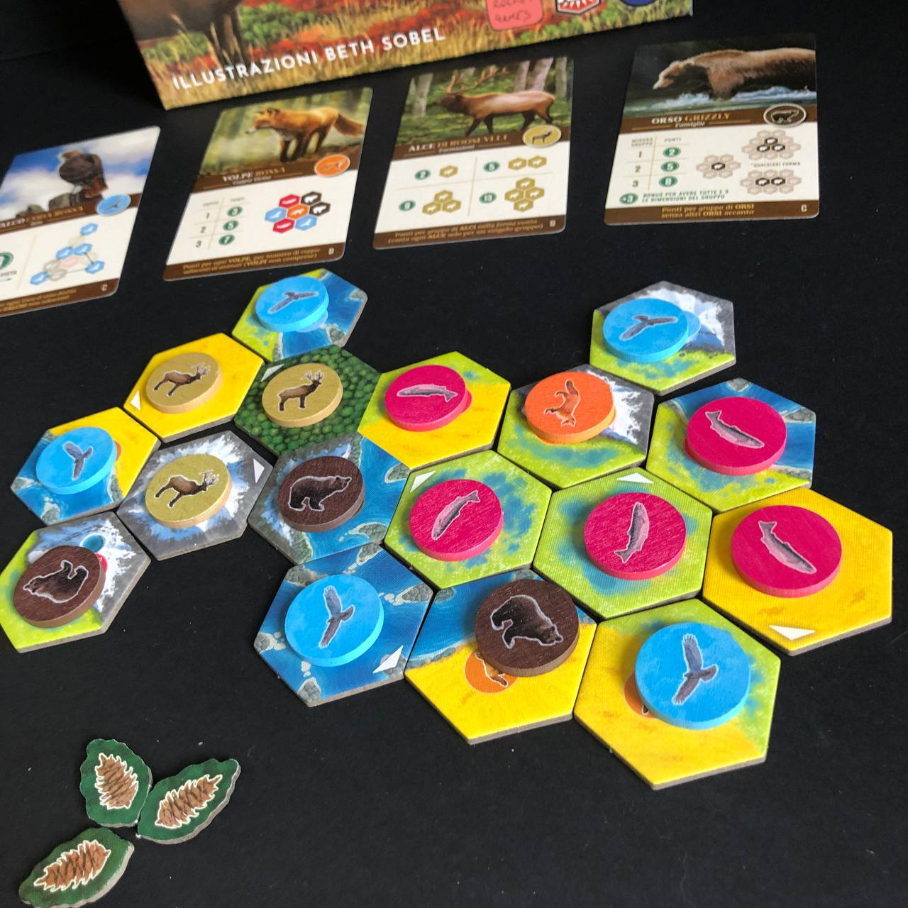

---
redirect_from:
  - /cascadia/
date: "2021-12-12"
writer: Fora
title: Cascadia
featureImage: cover.jpg
description: E l'avventura di oggi ci porta…
designer: Randy Flynn - Shawn Stankewich

publisher: Little Rocket Games
mechanisms:
  - Piazzamento tessere
  - Drafting
  - Punti fine partita

score: 7
playing_time: 30min
playing_time_official: 30-45min
weight: 2
player_count: 3
player_count_official: "1-4"

sidebar_votes:
  - title: Complessità
    value: 2
  - title: Preparazione
    value: 2
  - title: Fortuna
    value: 4
  - title: Longevità
    value: 4
  - title: Componenti
    value: 5
  - title: Portabilità
    value: 3

sleeves:
  - amount: 21
    size: 70x120

dungeondice_url: https://www.dungeondice.it/25072-cascadia.html
getyourfun_url: https://www.getyourfun.it/03869-cascadia-giochi-per-famiglia.html
fantasia_url: https://fantasiastore.it/it/giochi-per-esperti/12292-cascadia.html
blasone_url: https://www.blasoneshop.it/catalogo-little-rocket-games/cascadia-259-1481
pandoragames_url: https://pandoragames.it/collections/nuovo/products/cascadia
---

<Setting>
  Cascadia, Pacifico nord-ovest, è considerata una regione bellissima immersa
  nella natura più pura. Cosa potrebbe mai renderla più bella? L'immaginazione
  dei giocatori, ovviamente, che dovranno comporre delle nuove versioni di
  Cascadia nella propria plancia di gioco. Chi riuscirà a rendere Cascadia
  ancora più bella?
</Setting>

<Rules>
  Cascadia è un gioco molto semplice. Dopo aver preparato 20 tessere per
  giocatore più 3 e composto un mercato iniziale da quattro di queste tessere
  più altrettanti segnalini fauna il gioco potrà iniziare. A turno i giocatori
  otterranno una combinazione di tessera e segnalino fauna con cui espanderanno
  la loro personale Cascadia. Il gioco è davvero tutto qui. Ci saranno
  condizioni variabili di punteggio finale in grado di dare pepe ad ogni
  partita. Inoltre per ampliare il panorama delle cose da fare c'è un sistema di
  sfide integrabile sia nelle vostre partite in solitario che in quelle con più
  giocatori!
</Rules>

<Feedback>
  Cascadia è un gioco strano. Anzi, quasi zen. L'interazione tra i giocatori è
  minima, alla fine semplicemente rubare agli altri le tessere prima che le
  scelgano. Giocare in solitario o in multiplayer, perciò, non cambia nulla, se
  non per le chiacchierate che farete durante la partita: con gli altri o con il
  vostro gatto/cane/iguana. Il che non è necessariamente un male, si intenda!
  Detto questo, il gioco gira e mantiene le sue promesse di essere evocativo e
  rilassante. Perfetto per l'abbiocco post cenone di Natale!
</Feedback>

<Instagram id="CXYUQ_jAXyw" />
